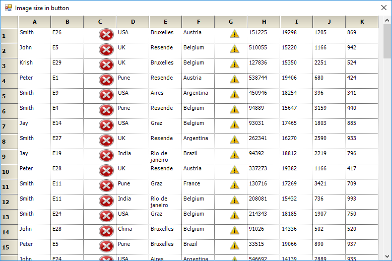

# How to Set Images on a Pushbutton in WinForms GridControl?

This example demonstrates how to set images on a Pushbutton in [WinForms GridControl](https://www.syncfusion.com/winforms-ui-controls/grid-control).

To set images on a PushButtons in GridControl column, draw the images with a specific size in the [DrawCellButton](https://help.syncfusion.com/cr/windowsforms/Syncfusion.Windows.Forms.Grid.GridControlBase.html#Syncfusion_Windows_Forms_Grid_GridControlBase_DrawCellButton) event.

``` csharp
//Event Triggering
this.gridControl1.DrawCellButton += GridControl1_DrawCellButton;

//Event Customization
private void GridControl1_DrawCellButton(object sender, GridDrawCellButtonEventArgs e)
{
    if (e.Style.CellType == GridCellTypeName.PushButton)
    {
        Bitmap bitmap = new Bitmap(30, 20);
        Rectangle rect = e.Button.Bounds;
        if (e.ColIndex == 3)
        {
            bitmap = new Bitmap(SystemIcons.Error.ToBitmap(), new Size(30, 25));
        }

        if (e.ColIndex == 7)
        {
            bitmap = new Bitmap(SystemIcons.Exclamation.ToBitmap(), new Size(20, 20));
        }

        e.Graphics.DrawImage(bitmap, rect.X + 30, rect.Y, bitmap.Width, bitmap.Height);
        e.Cancel = true;
    }
}
```

The screenshot below displays the image in pushbuttons.


